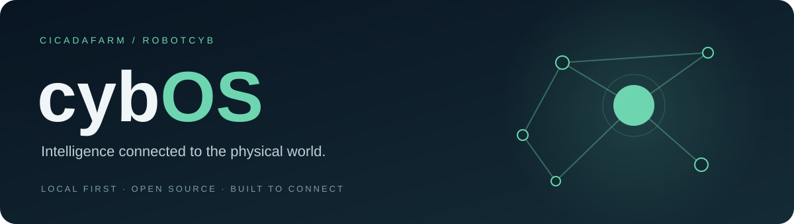

<div align="center">



**Локальный интеллект · Общая память · Связь с физическим миром**

[](https://github.com/c1cad4/cybOS/actions/workflows/ci.yml)
[](LICENSE)

[Начать](#быстрый-старт) · [Архитектура](docs/ARCHITECTURE.md) · [Каталог](ecosystem.json) · [Для агентов](AGENTS.md) · [Участвовать](CONTRIBUTING.md)

</div>

## Что такое cybOS

**cybOS — точка входа в экосистему CicadaFarm и RobotCYB.** Этот репозиторий содержит карту проектов, каталог зависимостей, фиксированные Git-ревизии и инструменты подготовки рабочей папки.

Нативный рабочий стол развивается в [CybOS-demo](https://github.com/c1cad4/CybOS-demo). Локальный HTTP API агентов и памяти находится в [CybCore](https://github.com/c1cad4/CybCore). Общая цель — соединить знания, людей, программных агентов и оборудование фермы.

## Быстрый старт

Для просмотра карты и проверки каталога достаточно Python 3.12+; установка Rust и скачивание остальных проектов не нужны.

```bash
git clone https://github.com/c1cad4/cybOS.git
cd cybOS
python3 -m unittest discover -s tests -v
python3 -m http.server 8004 --bind 127.0.0.1
```

Откройте **http://127.0.0.1:8004**. Карта позволяет искать проекты и выбирать категории.

Для подготовки всей экосистемы нужен Git и доступ к GitHub:

```bash
python3 tools/bootstrap.py
python3 tools/bootstrap.py --verify
python3 ../cybLaunch/launcher.py list
```

Bootstrap создаёт соседние checkout-папки по `ecosystem.lock.json`; существующие папки сохраняет. Проверка `--verify` сравнивает HEAD с закреплёнными ревизиями. Требования к сборке отдельных компонентов описаны в [руководстве разработчика](docs/DEVELOPMENT.md).

## Найдите свой проект

- **Рабочий стол:** [CybOS-demo](https://github.com/c1cad4/CybOS-demo) — нативный Rust/egui стенд.
- **Агенты и API:** [CybCore](https://github.com/c1cad4/CybCore) объединяет [CybAgents](https://github.com/c1cad4/CybAgents), [CybRegistry](https://github.com/c1cad4/CybRegistry) и [CybSwarm](https://github.com/c1cad4/CybSwarm).
- **Память:** [CybMemory](https://github.com/c1cad4/CybMemory) — сохранение и поиск знаний; [soul](https://github.com/c1cad4/soul) — типы памяти и графа для нативного приложения.
- **Сеть и документы:** [cybnet](https://github.com/c1cad4/cybnet), [CybBrowser](https://github.com/c1cad4/CybBrowser), [cybweb](https://github.com/c1cad4/cybweb) и [cybchat](https://github.com/c1cad4/cybchat).
- **Ферма и устройства:** [robotcyb-core](https://github.com/c1cad4/robotcyb-core) — worker/hardware контракты; [cybbee](https://github.com/c1cad4/cybbee) — наблюдения.
- **Политики действий:** [cybguard](https://github.com/c1cad4/cybguard) и [immunocybchain](https://github.com/c1cad4/immunocybchain).

Все проекты, команды проверок, ограничения и зависимости — в [машиночитаемом каталоге](ecosystem.json).

## Текущие границы

Операции сохранения и поиска знаний в CybCore работают без обязательной модели LLM. Опциональный помощник может подключаться к отдельно запущенной локальной модели; настройка и ограничения описаны в README CybCore. Статус `planned` в каталоге означает проект без реализованного рабочего сценария. Наблюдение фермы, контракт сети и библиотека политики сами по себе не означают подключённое оборудование или действующую сеть.

Нативные сборки и выпуски проверяйте на [странице релизов](https://github.com/c1cad4/cybOS/releases). Установка API и инструкции запуска рабочего стола находятся в соответствующих репозиториях.

## Для разработчиков и ИИ-агентов

1. Прочитайте [AGENTS.md](AGENTS.md) и [CONTRIBUTING.md](CONTRIBUTING.md).
2. Найдите владельца нужной функции в каталоге и [архитектуре](docs/ARCHITECTURE.md).
3. Внесите изменение в соответствующий компонент, проверьте его и приложение-интегратор.
4. Укажите в PR результат, команды проверки и оставшиеся ограничения.

[Разработка](docs/DEVELOPMENT.md) · [Границы новых компонентов](docs/NEW_COMPONENTS.md) · [Долгосрочное видение](docs/VISION.md)

---

Создано **Cicada** для **CicadaFarm · RobotCYB**. Код распространяется по [Apache License 2.0](LICENSE).
