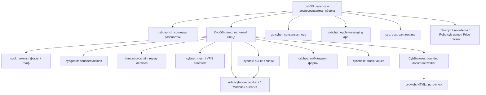

# Архитектура экосистемы

cybOS — точка сборки и каталог. CybOS-demo — рабочий нативный стенд. Владельцы библиотек находятся рядом и подключаются через явные зависимости; каждый компонент можно тестировать отдельно.

## Где находится источник истины

- UI, SQLite и связывание ячеек — `CybOS-demo`.
- Данные знаний и памяти — типы `soul`, сохраняемые SQLite-слоем приложения.
- Жизненный цикл worker и политика питания — `robotcyb-core`.
- Текст документа — `cybweb`; очередь запросов и bounded fetch — `CybBrowser`.
- Валидация действий — `cybguard`; выполнение остаётся явной обязанностью вызывающей стороны.
- Идентичность сообщений — `immunocybchain`; Noise-аутентификация и durable SQLite replay checks остаются в нативном CybChat.
- Наблюдения — `cybbee`; доступ к реальному устройству требует отдельного адаптера.
- Рынки — `cybdex`; транзакции и обмены не исполняются.
- Консенсус — существующий `go-cyber`; `cybchain` и `immunocybchain` не изображают новую работающую блокчейн-сеть.

## Статусы

`library` означает проверенный код библиотеки, `demo` — демонстрацию. Полный Bevy workspace `cyb` требует upstream-соседей, а `cybchat` — Apple SDK. Эти ограничения отображаются в каталоге и командах разработки.

`CybBrowser-` — дубликат, исключённый из сборки. Его удаление остаётся ручным действием владельца: доступное GitHub-подключение вернуло 403 при DELETE. Канонический проект — `CybBrowser`.
